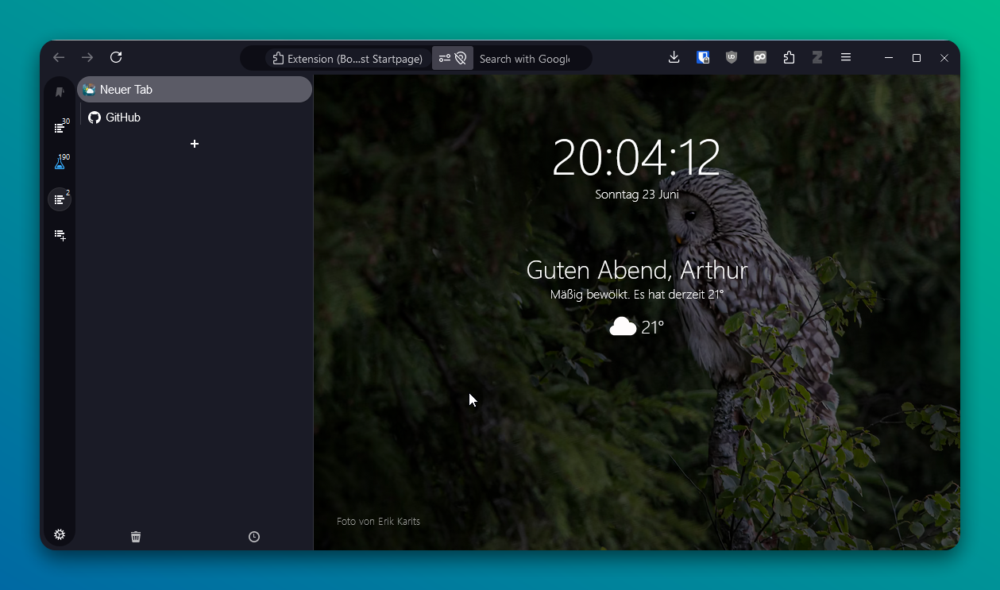

# 🔥Firebery🫐
⚠️ Work in Progress ⚠️

Firefox dark-mode theme for vertical tabs using Sidebery.

Inspired by [VerticalFox](https://github.com/christorange/VerticalFox).

## Instructions

1. Install [Sidebery](https://addons.mozilla.org/de/firefox/addon/sidebery/)
2. Download the source files:
   1. [sidebery_style.css](./styles/siderbery_style.css)
   2. [userChrome.css](./styles/userChrome.css)
3. Activate Firefox customization
   1. Go to `about:config`
   2. Set `toolkit.legacyUserProfileCustomizations.stylesheets` to `true`
4. Open your profile folder (Hint: `about:support`)
   1. Create a folder named `chrome` if not yet done
   2. Move [userChrome.css](./styles/userChrome.css) into `chrome`
5. Go to Siderbery settings and open the __Styles editor__
   1. Paste [sidebery_style.css](./styles/siderbery_style.css) into the editor
6. _Optional_: Import the Siderbery addon settings from [settings_export.json](./configuration/settings_export.json)

## License
[MIT](LICENSE)